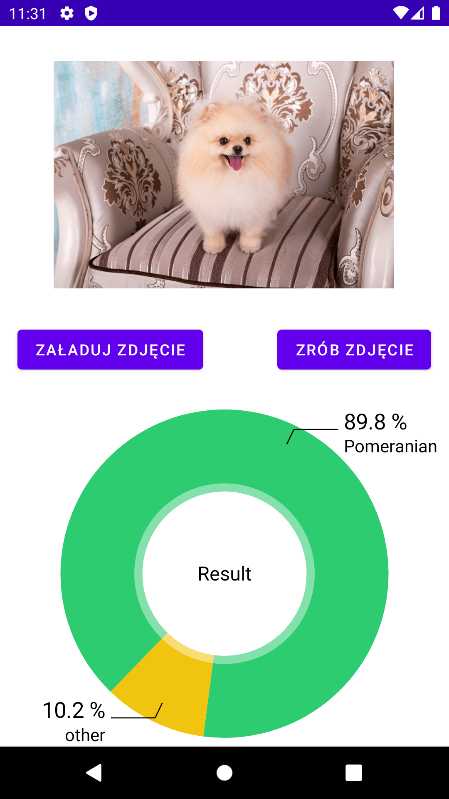
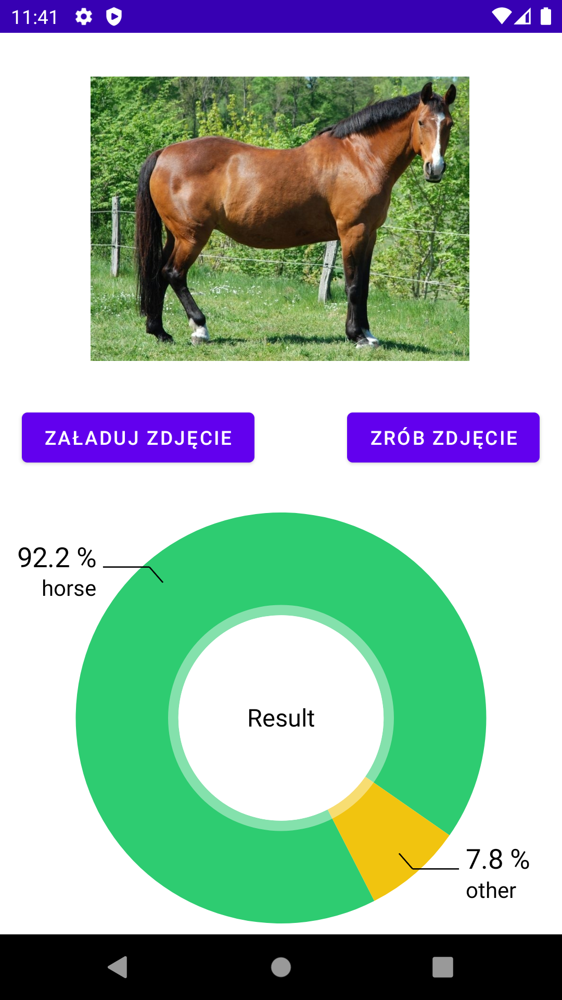

# Animal Recognition
> Android App that tries to identify animal from picture with over 200 races and dogs breeds.

## Technologies Used
- Java - Android Studio
- TensorFlow Lite - Python library

## DataSets Used
- https://www.kaggle.com/datasets/iamsouravbanerjee/animal-image-dataset-90-different-animals
- https://www.kaggle.com/datasets/sharansmenon/animals141
- https://www.kaggle.com/datasets/jessicali9530/stanford-dogs-dataset

## Features
- Load picture from gallery and app will try to identify it OR
- just take picture with your camera

## Screenshots
 

## Acknowledgements
> This app is the result of my first encounter with Machine learning in general.
> The Main ML model was generated using  tutorial 
